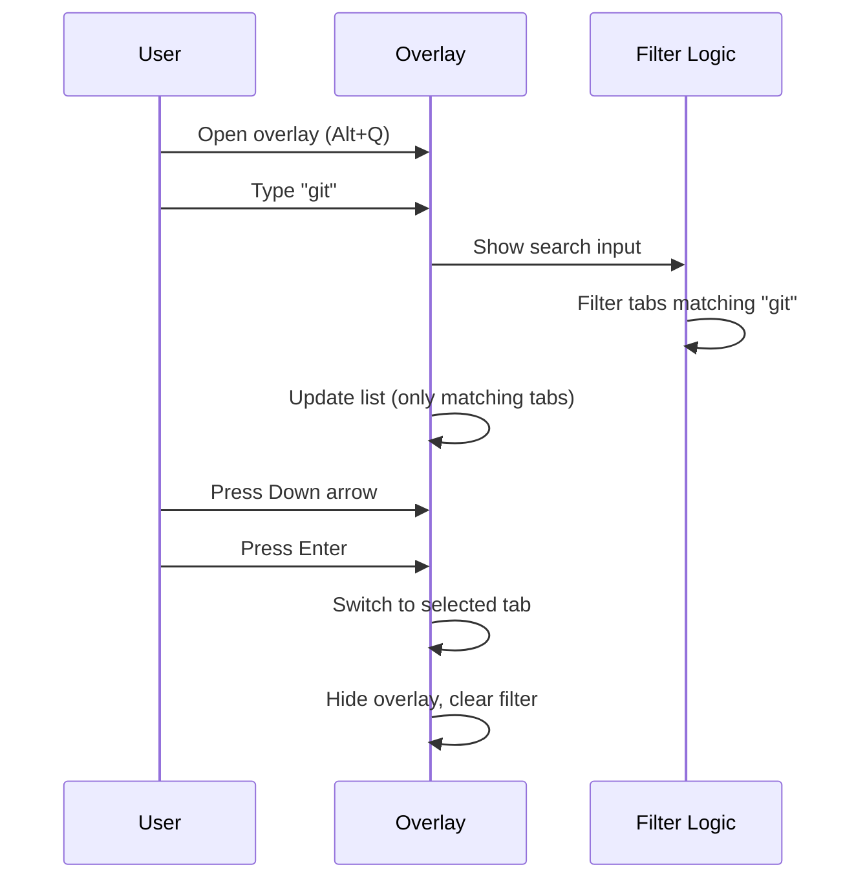

# Search & Filter

In-overlay search functionality for quickly finding tabs.

## Purpose

Enable users with many tabs to quickly locate specific tabs by typing part of the title or URL.

## Business Rules

1. Typing any alphanumeric character while overlay is open activates search
2. Filter matches against both tab title and URL
3. Case-insensitive matching
4. Empty filter results show all tabs
5. Filter persists until explicitly cleared or overlay closes

## Main Flow



## UI Behavior

| State | Search Input | Tab List |
|-------|--------------|----------|
| Initial | Hidden | All tabs |
| Typing | Visible, focused | Filtered tabs |
| No matches | Visible | "No matching tabs" |
| Escape | Hidden | All tabs restored |
| Enter/switch | Hidden | N/A (overlay closes) |

## Keyboard Shortcuts

| Key | Action |
|-----|--------|
| Any letter/number | Start type-ahead, append to filter |
| Ctrl+F | Focus search explicitly |
| Backspace | Delete last filter character |
| Escape | Clear filter (or close if empty) |
| ↑/↓ | Navigate filtered list |
| Enter | Switch to selected in filtered list |

## Matching Logic

```javascript
// Simplified matching
function tabMatchesFilter(tab, filter) {
  const lower = filter.toLowerCase();
  const title = (tab.title || '').toLowerCase();
  const url = (tab.url || '').toLowerCase();
  return title.includes(lower) || url.includes(lower);
}
```

## Test Flows

### Positive

1. **Type-ahead**: Type "doc" → Only tabs with "doc" in title/URL shown
2. **Clear filter**: Type, then Escape → All tabs restored
3. **Navigate filtered**: Filter → Arrow keys work on filtered list
4. **Switch filtered**: Filter → Enter → Correct filtered tab activates

### Negative

1. **No matches**: Type gibberish → "No matching tabs" shown
2. **Empty filter**: Clear all text → Full list restored

### Edge Cases

1. **Special characters**: Filter with `.`, `-`, etc. → Matches URL parts
2. **Very long filter**: 50+ characters → Still functions, no overflow
3. **Filter while scrolled**: List resets scroll position appropriately

## Definition of Done

- [ ] Type-ahead activates search on first character
- [ ] Filter matches title and URL (case-insensitive)
- [ ] Navigation works on filtered list
- [ ] Escape clears filter
- [ ] No visual glitches during filtering

---

*Implementation: [content.js](../../content.js) — search-related functions*
