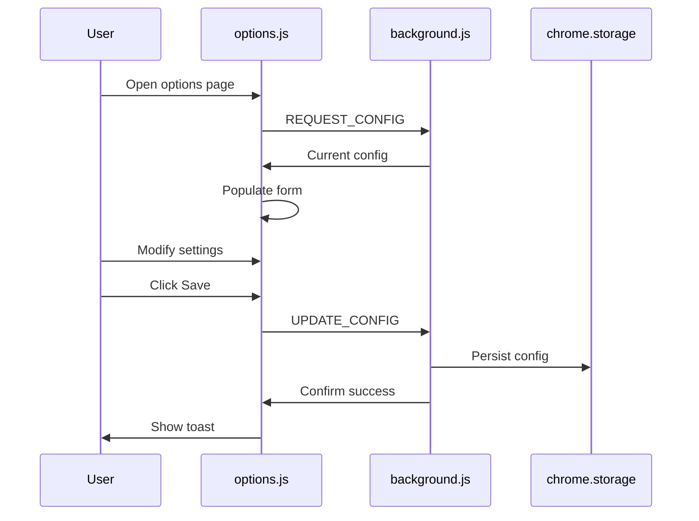

# Settings (Options Page)

User-configurable settings for AlternaTab behavior and appearance.

## Purpose

Allow users to customize the overlay appearance and behavior to match their workflow and preferences.

## Business Rules

1. Settings persist across browser sessions via `chrome.storage.local`
2. Changes apply immediately after saving (broadcast to all tabs)
3. Reset restores all settings to defaults
4. Domain colors override the default accent for matching tabs

## Configuration Options

| Setting | Type | Default | Description |
|---------|------|---------|-------------|
| Status Duration | Number | 2000ms | How long toast messages display |
| Compact Mode | Boolean | false | Reduced-height tab items |
| Domain Colors | Map | {} | Domain → hex color mapping |

## Main Flow

## Domain Colors

Users can assign accent colors to specific domains. The accent appears as a left border on matching tabs in the overlay.

| Input | Normalized | Color |
|-------|------------|-------|
| `github.com` | `github.com` | User-chosen |
| `https://www.google.com/search` | `google.com` | User-chosen |
| `localhost:3000` | `localhost` | User-chosen |

Normalization removes protocol, www prefix, port, and path.

## Test Flows

### Positive

1. **Load settings**: Open options → Form shows current values
2. **Save changes**: Modify setting → Save → Toast confirms, setting persists
3. **Add domain color**: Add new row → Set domain and color → Save → Reflected in overlay
4. **Reset**: Click reset → Confirm → All defaults restored

### Negative

1. **Invalid domain**: Empty domain field → Save → Row ignored or error shown
2. **Save failure**: Storage quota exceeded → Error toast

### Edge Cases

1. **Many domain colors**: 20+ entries → UI scrolls, all saved
2. **Duplicate domains**: Adding same domain twice → Latest value wins

## Definition of Done

- [ ] Options page loads without errors
- [ ] All controls reflect current config
- [ ] Save persists and broadcasts changes
- [ ] Reset restores defaults
- [ ] Domain colors work correctly in overlay

---

*Implementation: [options.js](../../options.js), [options.html](../../options.html), [options.css](../../options.css)*
