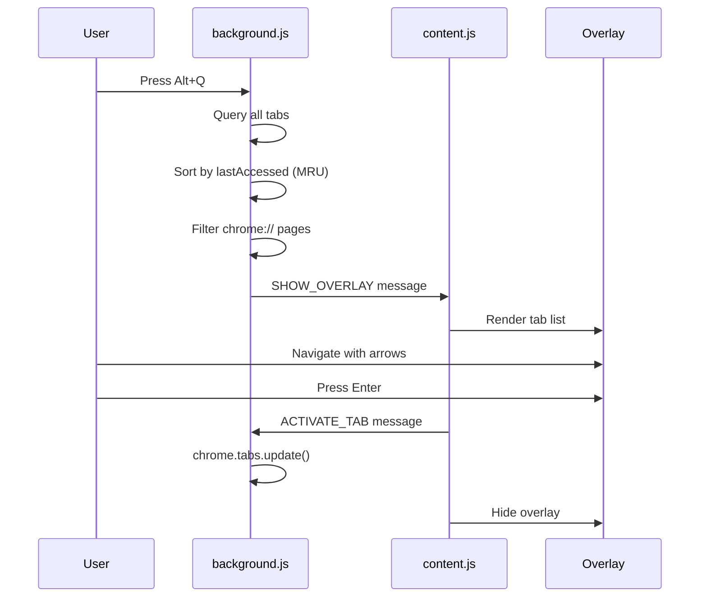

# Tab Overlay

The core feature of AlternaTab — an Alt+Tab-like overlay for navigating Chrome tabs.

## Purpose

Enable fast keyboard-driven tab switching without leaving the current page, mimicking the familiar Alt+Tab experience from operating systems.

## Business Rules

1. Overlay appears on the current active tab when triggered
2. Tabs are sorted by Most Recently Used (MRU) order using `lastAccessed`
3. System pages (`chrome://`, `chrome-extension://`) are filtered out
4. Overlay disappears when a tab is selected or Escape is pressed
5. User can close tabs from the overlay without switching

## Main Flow

## UI Components

| Element | Description |
|---------|-------------|
| Tab item | Favicon + title + domain + badges |
| Badges | Pinned (📌), Audio (🔊) indicators |
| Count label | "N tabs" in corner |
| Compact toggle | Reduces item height (Alt+C) |
| Loading state | Shown while fetching tabs |

## Keyboard Shortcuts

| Key | Action |
|-----|--------|
| Alt+Q | Toggle overlay |
| ↑/↓ | Navigate list |
| Enter | Switch to selected tab |
| Delete | Close selected tab |
| Escape | Hide overlay |
| Alt+C | Toggle compact mode |
| Any letter | Start type-ahead search |

## Test Flows

### Positive

1. **Basic toggle**: Alt+Q opens, Alt+Q closes
2. **Tab switch**: Open overlay → Arrow down → Enter → Correct tab activates
3. **Tab close**: Open overlay → Select tab → Delete → Tab closes, list updates

### Negative

1. **No tabs**: Only current tab exists → Shows "No other tabs" or similar
2. **Extension context invalidated**: Background page reloads → Graceful error message

### Edge Cases

1. **Many tabs (50+)**: List scrolls, performance acceptable
2. **Pinned tabs**: Shown with pin badge, cannot be closed easily
3. **Audio playing**: Tab shows audio indicator

## Definition of Done

- [ ] Overlay opens/closes reliably with Alt+Q
- [ ] Tab list shows correct tabs in MRU order
- [ ] All keyboard shortcuts function as documented
- [ ] Visual design matches existing styling
- [ ] No console errors during normal use

---

*Implementation: [content.js](../../content.js), [background.js](../../background.js)*
